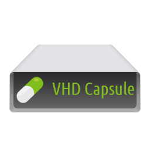
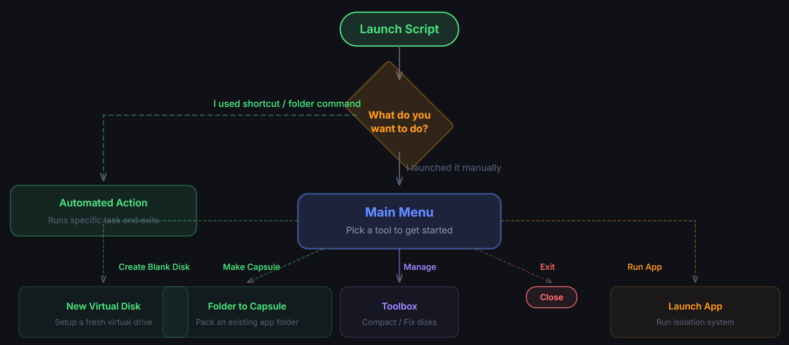

# VHD Capsule




A PowerShell-based VHD/VHDX manager with a specialized **Capsule Mode** that isolates applications inside virtual hard disks, tracks every filesystem change they make, and provides post-execution maintenance; all from a single script with no dependencies.


---

## Overview

VHD Capsule treats a virtual hard disk as a self-contained "capsule" for an application. Instead of installing software onto your main drive and letting it scatter files across your system, you pack the application into a VHD/VHDX, mount it on demand, run the app, and then see exactly what changed. When you're done, unmount it and your host system stays clean.

Beyond capsule isolation, the script is also a full-featured VHD lifecycle manager: create, mount, compact, defragment, and clean virtual disks through a guided, menu-driven interface or fully automated command-line parameters.

### How It Works



1. **Mount**: The VHD/VHDX is attached and assigned a drive letter dynamically.
2. **Snapshot**: A full recursive file listing is captured (path, timestamp, size).
3. **Execute**: Your application launches; the script waits for it to exit.
4. **Diff**: A second snapshot is taken and compared against the first, revealing every created, modified, or deleted file.
5. **Maintenance**: An interactive menu lets you compact, defragment, or clean junk before closing.
6. **Dismount**: The VHD is cleanly detached.

---

## Benefits

### Application Isolation

- Run applications inside a virtual disk without altering your host filesystem.
- All changes are contained within the VHD and nothing leaks onto your system drive.
- Ideal for testing, portable apps, or separating application data.

### Change Tracking

- See exactly which files an application created, modified, or deleted during a session.
- Useful for auditing, debugging, or understanding how software behaves on disk.

### Portability

- A single `.vhdx` file contains everything the application needs.
- Move it between machines by copying one file and no installers, no registry entries.
- Works on any Windows machine with PowerShell and Hyper-V / disk management support.

### Space Efficiency

- Dynamic VHDs grow only as data is written, not to their maximum size.
- Built-in compaction shrinks the VHD file by reclaiming unused space.
- NTFS compression can be enabled at creation time for additional savings.

### Zero Dependencies

- Pure PowerShell and no external modules, frameworks, or installers required.
- Uses only built-in Windows tools (`diskpart`, `Mount-DiskImage`, `robocopy`, `Optimize-Volume`).
- Automatically elevates to Administrator when needed.

### Automation-Ready

- Every operation can be driven entirely from command-line parameters.
- The `-Force` flag skips all interactive prompts for unattended execution.
- Integrates cleanly into scripts, scheduled tasks, and CI/CD pipelines.

---

## Requirements

- **Windows 10 / 11** or **Windows Server 2016+**
- **PowerShell 5.1** or later (ships with Windows)
- **Administrator privileges** (the script auto-elevates via UAC if not already elevated)

No Hyper-V role installation is required and the script uses native `diskpart` and `Mount-DiskImage` which are available on all modern Windows editions.

---

## Features

| Feature                        | Description                                                                                                                                                       |
| ------------------------------ | ----------------------------------------------------------------------------------------------------------------------------------------------------------------- |
| **Create VHD/VHDX**            | Step-by-step wizard: format, filename, size, type (dynamic/fixed), partition style (GPT/MBR), filesystem (NTFS/FAT32), allocation unit, compression, volume label |
| **Create Capsule from Folder** | Convert any folder into a self-contained VHDX with automatic size calculation and Robocopy-based transfer                                                         |
| **Browse & Select**            | Scan the current directory for VHD/VHDX files and pick one from a numbered list                                                                                   |
| **Mount / Dismount**           | Robust mounting with automatic drive letter assignment, diskpart fallback, and already-mounted VHD detection                                                      |
| **Capsule Mode**               | Mount → Snapshot → Execute → Diff → Maintenance lifecycle                                                                                                         |
| **Companion Mode**             | Rename the script to match a VHD filename and double-click to auto-launch Capsule Mode                                                                            |
| **Compact**                    | Shrink dynamic VHD files by reclaiming unused space                                                                                                               |
| **Defragment**                 | Optimize the filesystem inside the VHD                                                                                                                            |
| **Clean Junk**                 | Remove `$RECYCLE.BIN` and `System Volume Information` from inside the VHD                                                                                         |
| **Current State**              | Display physical size, free space, file count, and fragmentation analysis                                                                                         |
| **Info**                       | Display script version and description from the main menu                                                                                                         |

---

## Usage

### Interactive Mode (Default)

Simply run the script with no parameters to enter the interactive menu:

```powershell
.\vhd-capsule.ps1
```

This presents the main menu:

```
========================================
   VHD CAPSULE v1.0.2.5 : Main Menu
========================================

1. Create VHD (Initialize & Format)
2. Create VHD Capsule from folder
3. Browse VHD (Select from list)
4. Manual Select VHD (Path input)
5. Launch VHDX in Capsule Mode
6. Info

0. Exit
```

Each option guides you through the process step-by-step with clear prompts, defaults, and a `0. Cancel` option at every stage.

---

### Capsule Mode

Launch an application inside a VHD capsule and track filesystem changes:

```powershell
# Interactive and prompts for the app path after mounting
.\vhd-capsule.ps1 -Mode Capsule -VHDPath "C:\Capsules\MyApp.vhdx"

# Fully specified and launches the app directly
.\vhd-capsule.ps1 -Mode Capsule -VHDPath "C:\Capsules\MyApp.vhdx" -AppPath "launch_app.lnk"
```

**Default Launcher:** If a file named `launch_app.lnk` exists in the root of the VHD, it will be offered as the default when no `-AppPath` is specified. This makes it easy to set up capsules with a standard shortcut.

**What happens during a session:**

```
[1/4] Mounting...
Mounting C:\Capsules\MyApp.vhdx...
Drive: E:

[2/4] Taking filesystem snapshot...

[3/4] Launching launch_app.lnk...
      (Application runs and script waits for it to exit)
Execution Finished.

Analyzing changes...

FullName                          LastWriteTime         Length SideIndicator
--------                          -------------         ------ -------------
E:\AppData\settings.json          2/19/2026 10:30:15 PM   2048 =>
E:\Logs\session.log               2/19/2026 10:30:15 PM   4096 =>

[4/4] Maintenance Menu

1. Current State
2. Compact
3. Defrag
4. Clean Junk

0. Dismount and Exit [Default]
```

The diff table uses `=>` for new/modified files and `<=` for deleted files.

> **Note:** When Capsule Mode is launched via command-line arguments or Companion Mode ("Direct Launch"), option 0 reads **"Dismount and Exit"** and pressing Enter defaults to it. When launched from the interactive menu, it reads **"Go back to main menu"** instead.

If the VHD is already mounted when Capsule Mode starts, the script **detects the existing mount** and reuses the drive letter instead of failing.

---

### Manager Mode

Open the operations menu for a specific VHD:

```powershell
.\vhd-capsule.ps1 -Mode Manager -VHDPath "C:\Capsules\MyApp.vhdx"
```

This brings up the operations menu with options to launch in Capsule Mode, mount/dismount, inspect current state, compact, defragment, or clean junk.

---

### Creating a VHD Capsule from a Folder

Convert an existing application folder into a self-contained VHDX capsule:

```powershell
# Interactive and prompts for every option
.\vhd-capsule.ps1
# Then select option 2 from the main menu

# Semi-automated and specify source, use defaults for the rest
.\vhd-capsule.ps1 -SourceFolder "C:\Apps\MyApp"

# Fully specified
.\vhd-capsule.ps1 -SourceFolder "C:\Apps\MyApp" -DestinationPath "D:\Capsules" -SizeGB 20

# Fully automated and skip the confirmation prompt
.\vhd-capsule.ps1 -SourceFolder "C:\Apps\MyApp" -DestinationPath "D:\Capsules" -SizeGB 20 -Force
```

**What happens:**

1. The source folder is scanned to calculate its size.
2. A VHDX is created with sensible defaults (dynamic, GPT, NTFS, 4K allocation).
3. A review screen shows all settings and you can modify or proceed.
4. The VHD is created, formatted, mounted, and all files are copied via Robocopy.
5. A final report shows source vs. destination item counts, sizes, and copy duration.

**Size calculation:**

- **Minimum:** Source size + 2 GB (headroom for filesystem overhead).
- **Default:** Source size + 5 GB (comfortable working space).
- The script enforces the minimum and warns if a manually entered size is too small.

---

## Companion Mode

Companion Mode provides the simplest possible way to launch a capsule and just **rename the script** to match your VHD file and double-click it.

### How It Works

1. Copy `vhd-capsule.ps1` next to your VHD file.
2. Rename the copy to match the VHD filename (e.g., `MyApp.ps1` for `MyApp.vhdx`).
3. Double-click the renamed script and it auto-detects the matching VHD and launches Capsule Mode.

```
D:\Capsules\
├── MyApp.ps1       ← renamed copy of vhd-capsule.ps1
├── MyApp.vhdx      ← companion VHD (auto-detected)
└── AnotherApp.ps1  ← another renamed copy
└── AnotherApp.vhd  ← works with .vhd too
```

### Detection Logic

- The script checks its own filename (e.g., `MyApp.ps1` → `MyApp`).
- If the name is **not** `vhd-capsule` (the default) and **no arguments** were passed:
  - It looks for `MyApp.vhdx` in the same directory.
  - Falls back to `MyApp.vhd` if no `.vhdx` is found.
  - If a match is found, launches Capsule Mode with `launch_app.lnk` as the default app path.
- If no matching VHD exists, the normal interactive menu is shown.

### Setting Up a Companion Capsule

```powershell
# 1. Create the capsule from a folder
.\vhd-capsule.ps1 -SourceFolder "C:\Apps\MyApp" -DestinationPath "D:\Capsules" -Force

# 2. Copy the script next to it and rename
Copy-Item .\vhd-capsule.ps1 "D:\Capsules\MyApp.ps1"

# 3. Make sure launch_app.lnk exists in the VHD root
# (Create a shortcut to the main executable inside the VHD)

# 4. Double-click MyApp.ps1 and done!
```

This makes each capsule fully self-contained: one `.ps1` + one `.vhdx`, no arguments needed.

---

## Command-Line Reference

### Parameters

| Parameter          | Type   | Default  | Description                                                       |
| ------------------ | ------ | -------- | ----------------------------------------------------------------- |
| `-VHDPath`         | String | -        | Path to a VHD/VHDX file to operate on.                            |
| `-Mode`            | String | `Menu`   | Startup mode: `Menu`, `Manager`, or `Capsule`.                    |
| `-AppPath`         | String | -        | Relative path to the executable inside the VHD (Capsule Mode).    |
| `-SourceFolder`    | String | -        | Path to an existing folder to convert into a VHD capsule.         |
| `-DestinationPath` | String | -        | Where to create the output VHDX (used with `-SourceFolder`).      |
| `-SizeGB`          | String | -        | VHD size in GB (used with `-SourceFolder`).                       |
| `-Force`           | Switch | `$false` | Skip interactive confirmation prompts.                            |
| `-InitialDir`      | String | -        | Set the working directory (used internally during UAC elevation). |

### Modes

| Mode      | Requires   | Behavior                                         |
| --------- | ---------- | ------------------------------------------------ |
| `Menu`    | Nothing    | Interactive main menu (default).                 |
| `Manager` | `-VHDPath` | Opens the operations menu for the specified VHD. |
| `Capsule` | `-VHDPath` | Launches Capsule Mode for the specified VHD.     |

When `-SourceFolder` is provided, it takes **priority over `-Mode`** and goes directly to VHD creation.

---

## Automation Examples

### Create a Capsule and Launch It

```powershell
# Step 1: Package the app folder into a VHDX
.\vhd-capsule.ps1 -SourceFolder "C:\PortableApps\Notepad++" -DestinationPath "D:\Capsules" -SizeGB 5 -Force

# Step 2: Launch it in Capsule Mode
.\vhd-capsule.ps1 -Mode Capsule -VHDPath "D:\Capsules\Notepad++.vhdx" -AppPath "notepad++.exe"
```

### Batch Convert Multiple Folders

```powershell
$apps = @(
    "C:\PortableApps\Firefox",
    "C:\PortableApps\VLC",
    "C:\PortableApps\7-Zip"
)

foreach ($app in $apps) {
    .\vhd-capsule.ps1 -SourceFolder $app -DestinationPath "D:\Capsules" -Force
}
```

### Scheduled Task for Maintenance

Create a Windows Scheduled Task that compacts a capsule weekly:

```powershell
# maintenance.ps1
$capsules = Get-ChildItem "D:\Capsules\*.vhdx"
foreach ($vhd in $capsules) {
    .\vhd-capsule.ps1 -Mode Manager -VHDPath $vhd.FullName
    # Note: Compact requires interactive selection from the Manager menu.
    # For fully unattended compaction, use diskpart directly:
    $script = "select vdisk file=`"$($vhd.FullName)`"`nattach vdisk readonly`ncompact vdisk`ndetach vdisk"
    $script | Out-File "$env:TEMP\compact.txt" -Encoding ASCII
    diskpart /s "$env:TEMP\compact.txt"
    Remove-Item "$env:TEMP\compact.txt"
}
```

### Desktop Shortcut for a Capsule

Create a shortcut with the following target:

```
powershell.exe -NoProfile -ExecutionPolicy Bypass -File "D:\Scripts\vhd-capsule.ps1" -Mode Capsule -VHDPath "D:\Capsules\MyApp.vhdx" -AppPath "launch_app.lnk"
```

Set **Run as Administrator** in the shortcut's advanced properties for seamless UAC handling.

### Context Menu Integration (Right-Click on Folder)

Add a "Create VHD Capsule" option to the Windows Explorer right-click menu:

```reg
Windows Registry Editor Version 5.00

[HKEY_CLASSES_ROOT\Directory\shell\VHDCapsule]
@="Create VHD Capsule"

[HKEY_CLASSES_ROOT\Directory\shell\VHDCapsule\command]
@="powershell.exe -NoProfile -ExecutionPolicy Bypass -File \"D:\\Scripts\\vhd-capsule.ps1\" -SourceFolder \"%V\" -Force"
```

Save as a `.reg` file and import, or add via `regedit`.

---

## VHD Creation Options

When creating a VHD through the interactive wizard (`New-VHDItem`), you control every aspect:

| Step | Option              | Choices                                       |
| ---- | ------------------- | --------------------------------------------- |
| 1    | **Format**          | VHDX (default) or VHD                         |
| 2    | **Filename**        | Any name; extension is auto-appended          |
| 3    | **Size**            | Size in GB (default: 10 GB)                   |
| 4    | **Disk Type**       | Dynamic / expandable (default) or Fixed       |
| 5    | **Partition Style** | GPT (default) or MBR                          |
| 6    | **File System**     | NTFS (default) or FAT32                       |
| 6b   | **Compression**     | NTFS-only: enable file/folder compression     |
| 7    | **Allocation Unit** | 14 choices from 512 B to 2 MB (default: 4 KB) |
| -    | **Volume Label**    | Custom label (default: "New Volume")          |

### Dynamic vs Fixed

| Type        | Pros                                                  | Cons                                        |
| ----------- | ----------------------------------------------------- | ------------------------------------------- |
| **Dynamic** | Only uses disk space as data is written; starts small | Slightly slower due to on-demand allocation |
| **Fixed**   | Best I/O performance; pre-allocated                   | Uses full disk space immediately            |

### GPT vs MBR

| Style   | Use When                                         |
| ------- | ------------------------------------------------ |
| **GPT** | Modern systems, disks > 2 TB, UEFI compatibility |
| **MBR** | Legacy systems or maximum compatibility          |

### Allocation Unit Recommendations

| Unit Size  | Best For                                |
| ---------- | --------------------------------------- |
| 4 KB       | General use, OS drives, mixed workloads |
| 64 KB      | Large databases, VM storage             |
| 16–32 KB   | Media files, ISOs, archives             |
| 512 B–2 KB | Legacy or embedded systems              |

---

## Troubleshooting

### Script requires Administrator

The script auto-detects if it's running without admin rights and relaunches itself elevated via UAC. All parameters are preserved during re-elevation.

### VHD is already mounted

The script **automatically detects** if the VHD is already attached and reuses the existing drive letter. If the VHD is mounted but has no drive letter assigned, it will assign one via diskpart. No manual intervention needed.

### No drive letter after mounting

The script uses a two-stage mount approach:

1. First, it tries `Mount-DiskImage` and checks for an auto-assigned letter.
2. If no letter is assigned, it picks a free drive letter and assigns it explicitly via `diskpart`.

### VHD file is locked / cannot be accessed

The script detects locked or inaccessible VHDs and shows a clear error message with guidance. Common causes:

- Disk Management has the VHD open
- Hyper-V is using the VHD
- Another instance of the script is operating on the same file

Fix: Close any tools that have the VHD open, or use `Dismount-DiskImage -ImagePath "path"` to force-release it.

### Robocopy exits with code 1–7

Robocopy exit codes 1–7 are **not errors**. They indicate various "success with details" statuses (e.g., files were copied, extra files found). Only codes ≥ 8 indicate actual failures.

---

## Project Structure

```
vhd-capsule/
├── vhd-capsule.ps1    # Main script - the entire tool in one file
└── README.md          # This documentation
```

---

## License

This project is provided as-is for personal and educational use.
